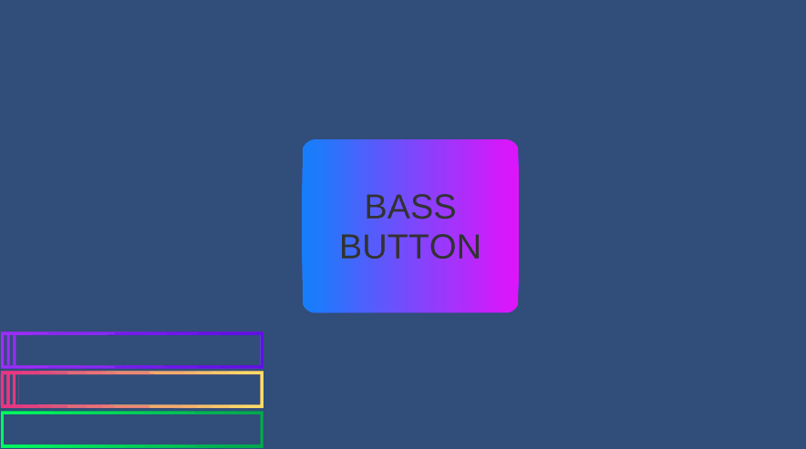

# Frequencify
A track analyzing tool to audio-responsive enhance the environment 

# How to use it

1. Import in your scene the **AudioAnalizer** prefab
2. Choose the **Active Track** you prefer
3. Attach the **AudioReactiveComponent** script to every component you want to enhance!
4. Press Play!

> Or just go in the **Example Scene**. 
